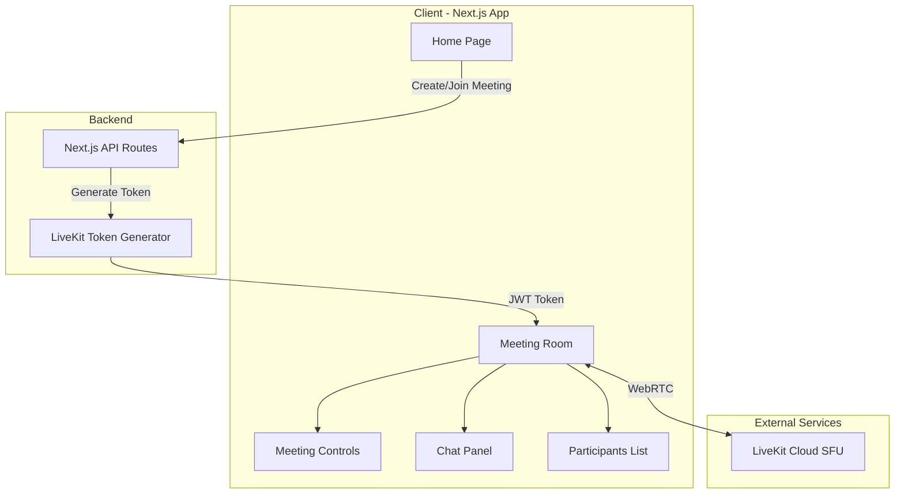

# Video Meeting App with Next.js and LiveKit

## Architecture Overview



## Phase 1: Setup and Figma MCP Installation

### Step 1.1: Install Framelink Figma MCP

1. Get a Figma API token from your Figma account settings
2. Add the Framelink MCP server to Cursor's MCP config
3. Use the MCP to extract design specs from your Figma file

### Step 1.2: Initialize Next.js Project

- Create Next.js 14+ app with App Router
- Install dependencies: `@livekit/components-react`, `livekit-client`, `livekit-server-sdk`
- Set up Tailwind CSS for styling
- Configure environment variables for LiveKit

## Phase 2: Core Pages and Components

### Page Structure

```
app/
├── page.tsx                    # Home - "New Meeting" button + join form
├── meeting/[code]/page.tsx     # Meeting room
├── api/
│   ├── meeting/route.ts        # Create meeting, generate code
│   └── token/route.ts          # Generate LiveKit access token
```

### Key Components

- `MeetingControls` - Mute/unmute mic, toggle video, leave button
- `ParticipantsList` - Show all participants with audio/video status
- `ChatPanel` - Real-time text chat using LiveKit data channels
- `VideoGrid` - Display participant video tiles

## Phase 3: LiveKit Integration

### LiveKit Cloud Setup

1. Create free account at livekit.io
2. Get API Key and Secret
3. Store in `.env.local`

### Token Generation Flow

1. User clicks "New Meeting" or enters code to join
2. API route generates unique meeting code (for new meetings)
3. API route creates LiveKit JWT token with room name = meeting code
4. Client connects to LiveKit room with token

## Phase 4: Meeting Features

### Video/Audio Controls

- Use LiveKit hooks: `useLocalParticipant`, `useRoomContext`
- Toggle track publication for mic/camera

### Participants List

- Use `useParticipants` hook to get all room participants
- Show connection status, audio/video indicators

### Chat

- Use LiveKit DataChannel via `useDataChannel` hook
- Send/receive text messages in real-time
- Display chat history during session

## Tech Stack Summary

| Layer | Technology |

|-------|------------|

| Framework | Next.js 14+ (App Router) |

| Video/Audio | LiveKit (Cloud or self-hosted) |

| Styling | Tailwind CSS |

| Icons | Lucide React |

| Chat | LiveKit Data Channels |

| State | React hooks (no extra state lib needed) |

## Environment Variables Required

```
LIVEKIT_API_KEY=your_api_key
LIVEKIT_API_SECRET=your_api_secret
LIVEKIT_URL=wss://your-project.livekit.cloud
```

## Next Steps

Once you approve this plan, we will:

1. First set up the Framelink Figma MCP so I can reference your designs
2. Then build the app step-by-step, matching your Figma designs